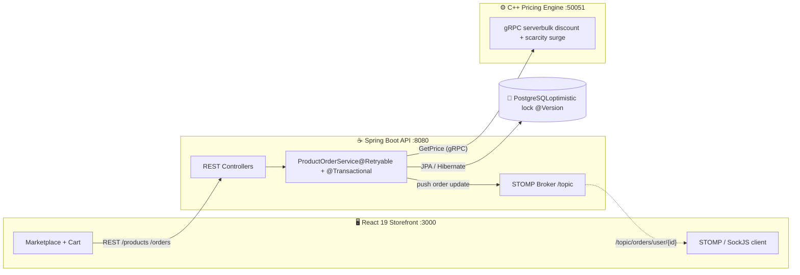

# 👋 Hi, I'm Ben Nguyen

**🎓Computer Engineering Student at The University of Florida. 🐊**

Specialized in embedded systems and low-level software.  
I enjoy taking on tasks that challenge me in new ways.   Passionate about creating efficient and optimized devices.

## 📫 Connect with Me!
Phone: (239) 888-0663

## Featured Projects
<h1 align="center">🛒 E-Commerce Platform</h1>

  <em>A full-stack, polyglot commerce backend engineered for correctness under concurrency — from a C++ pricing microservice up through a real-time React storefront.</em>

  
  
  
  
  
  
  

🔗 [View Repo](https://github.com/HuuBen5334/ecommerce-fullstack) 

---

## 🎬 Demo

---

## 📖 Overview

This project is a production-shaped e-commerce backend with a complete storefront on top of it. It started as a CRUD REST API and grew into a **four-tier distributed system** built to answer one hard question that every real marketplace faces:

> **What happens when 50 people try to buy the last item at the same time?**

Getting that right meant deliberately reaching past a single language and a single process — a **C++ pricing engine** for hot-path dynamic pricing, **optimistic locking with automatic retry** for inventory integrity, a **WebSocket layer** for live order updates, and a **Locust load-test harness** to prove it all holds up under real concurrency rather than assuming it does.

---

## 🏗️ Architecture

Each tier is independently runnable and speaks a purpose-fit protocol: **REST** for the storefront, **gRPC** for low-latency internal pricing calls, and **STOMP-over-WebSocket** for server-pushed order events.

---

## ⭐ Engineering Highlights

These are the parts I'm most proud of — where the interesting problems lived.

### 1. Surviving concurrent checkout

A 50-user concurrent checkout load test exposed an **`ObjectOptimisticLockingFailureException` failure rate of ~96%** — dozens of users colliding on the same product's stock row.

The fix was layered, not a band-aid:

- **`@Version` optimistic locking** on `Product` so no two transactions can silently overwrite each other's stock decrement.
- **`@Retryable` with exponential backoff** (3 attempts, 50 ms → 100 ms) wrapped *outside* the transaction so each retry runs in a **fresh transaction** — proxy ordering enforced explicitly via `TransactionConfig`.
- **FK indexes** added on `product_order.product_id` and `product_order.user_id` to keep order writes fast as volume grew.

The result: contention is absorbed gracefully and the same load test passes cleanly.

> **Why optimistic over pessimistic?** Optimistic locking wins on throughput in the general case. Pessimistic locking would be the right call only under sustained flash-sale contention — a tradeoff I made consciously and documented rather than defaulted into.

### 2. A C++ pricing microservice over gRPC

Pricing logic lives in a **multi-threaded C++ service** (`:50051`) instead of the JVM:

- Two RPCs — `GetPrice` (bulk-discount + scarcity-surge model) and `UpdateDiscount` (per-product admin override).
- A `std::shared_mutex` guards the discount-override map: many concurrent readers on the price path, exclusive writers only on admin updates.
- The backend calls it via a generated `PricingServiceBlockingStub` *before* snapshotting `priceAtPurchase`, so every order captures the exact price the customer saw.

### 3. Real-time order notifications

The moment an order is placed, the customer sees it — no polling:

- STOMP broker on `/topic`, customers subscribe to `/topic/orders/user/{userId}`.
- The React client connects through `@stomp/stompjs` + `sockjs-client` and renders a live feed.
- Payload is a typed Java `record` (`OrderUpdateMessage`) serialized to JSON.

### 4. Tested at the layer that matters

- **Mockito unit tests** isolate `ProductOrderService` (mocked gRPC stub + notifier).
- **`@WebMvcTest` slice tests** cover the controller/HTTP contract.
- **Full `@SpringBootTest` WebSocket integration test** spins up a real STOMP client over SockJS against an H2 DB and asserts message delivery within a 5 s budget.

---

## 🧰 Tech Stack

| Layer | Technology |
|---|---|
| **API** | Spring Boot 3.5 · Java 21 · Spring Data JPA (Hibernate) |
| **Resilience** | Spring Retry · Spring AOP · optimistic locking (`@Version`) |
| **Database** | PostgreSQL · `BigDecimal` money · FK + PK indexing |
| **Pricing service** | C++ · gRPC · Protocol Buffers · `std::shared_mutex` |
| **Real-time** | STOMP · SockJS · in-memory `SimpleBroker` |
| **Frontend** | React 19 · React Router 7 · custom hooks · `React.memo` + lazy/`Suspense` |
| **Load testing** | Locust |

---

## 🔌 API Reference

<strong>Products — <code>/products</code></strong>

| Method | Path | Status |
|--------|------|--------|
| GET | `/products` | 200 |
| GET | `/products/{id}` | 200 / 404 |
| POST | `/products` | 201 |
| PUT | `/products/{id}` | 200 / 404 |
| DELETE | `/products/{id}` | 204 / 409 *(FK conflict)* |

<strong>Users — <code>/users</code></strong>

| Method | Path | Status |
|--------|------|--------|
| GET | `/users` | 200 |
| GET | `/users/{id}` | 200 / 404 |
| POST | `/users` | 201 |
| PUT | `/users/{id}` | 200 / 404 |
| DELETE | `/users/{id}` | 204 / 409 *(FK conflict)* |

<strong>Orders — <code>/orders</code></strong>

| Method | Path | Status |
|--------|------|--------|
| GET | `/orders` | 200 |
| GET | `/orders/{id}` | 200 / 404 |
| POST | `/orders?productId=&userId=&quantity=` | 201 *(→ `ProductOrderService`)* |
| PUT | `/orders/{id}` | 200 / 404 |
| DELETE | `/orders/{id}` | 204 |

**WebSocket:** subscribe to `/topic/orders/user/{userId}` → receives `{ orderId, userId, status, priceAtPurchase }` after each `placeOrder()`.

---
### <h1 align="center">🐟 Fish Schooling</h1>
An interactive aquatic simulation sandbox that simulates real-world steering behaviors in a fun and playful manner.

**Features:**
- Utilizes steering algorithms such as pursuit, obstacle avoidance, and flocking.
- Users define the steering parameters and are able visualize the effects of those changes.

  
🔗 [View Repository](https://github.com/HuuBen5334/FishSchooling)
## 🛠️ Tech Stack

## 📫 Connect with Me!
Phone: (239) 888-0663

<!--- 
<!---
HuuBen5334/HuuBen5334 is a ✨ special ✨ repository because its `README.md` (this file) appears on your GitHub profile.
You can click the Preview link to take a look at your changes.
--->
